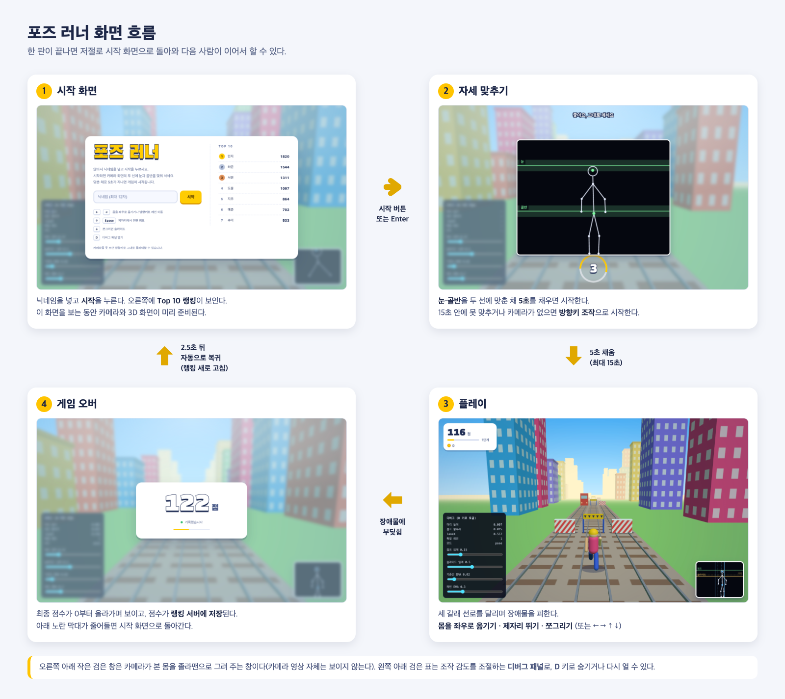

# 포즈 러너

포즈로 조작하는 3레인 엔드리스 러너다. 카메라 앞 1.5~2m 에 서서 실제로 걷고, 뛰고,
쪼그려서 장애물을 피한다. 카메라가 없거나 몸을 못 찾으면 화살표 키로도 플레이할 수 있다.

## 화면 흐름



## 설치

```bash
npm install
```

## 로컬 실행

```bash
npx wrangler d1 execute pose-runner --local --file=schema.sql   # 처음 한 번
npm run dev
```

브라우저에서 `http://localhost:8787/` 을 연다.

## 조작

카메라가 있으면 몸으로, 없거나 몸을 못 찾으면 화살표 키로 조작한다.

- 좌우 이동: 몸을 좌우로 옮기기 / `←` `→`
- 점프: 제자리에서 뛰기 / `↑` 또는 `Space`
- 슬라이드: 쪼그리기 / `↓`
- `D` 키: 디버그 패널 토글

## 테스트

```bash
npm test
```

`http://localhost:8787/?test=1` 을 열면 InputMapper 셀프 테스트 결과를 볼 수 있다.

## 설계 문서

설계와 계획의 전체 맥락은 `docs/superpowers/specs/`와 `docs/superpowers/plans/`에 있다.

## 참고

`DEFAULT_CFG`의 점프/슬라이드 임계값은 검증되지 않은 초기값이다. 실제 카메라와 몸으로
디버그 패널을 보면서 튜닝이 필요하다.

시작을 누르면 카메라 영상 대신 관절만 그린 졸라맨 화면에 눈·골반 기준선이 뜨고, 둘을
맞춘 채 5초가 지나야 게임이 시작된다(15초 안에 못 맞추면 그냥 시작). 기준선 위치와 허용 오차는 `ALIGN`에 있고,
이 역시 계산으로 잡은 초기값이라 실제로 서 보면서 조정이 필요하다.

화면은 Three.js 로 그린 3D 장면이다(인터넷에서 받아온다).
